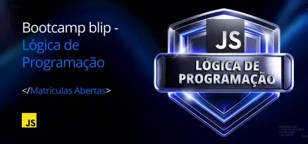

### BOOTCAMP BLIP - LÓGICA DE PROGRAMAÇÃO

Repósitório para implementação dos códigos desenvolvidos durante o **Bootcamp Blip - Lógica de Programação**, oferecido em parceria com a plataforma de ensino **Digital Innovation One - DIO**.

### Links

- [Digital Innovation One (DIO)](https://www.dio.me)
- [Bootcamp Blip - Lógica Programação](https://www.dio.me/bootcamp/blip-logica-de-programacao)

### Conceitos Desenvolvidos

[**Intodução Lógica Programação**](#introdução-logica-programação) |
[**Operadores**](#operadores) |
[**Estruturas de Controle**](#estruturas-controle) |
[**Funções**](#funções) |
[**Desafios de Projetos**](#desafios-projetos)

- [**Introdução à Lógica de Programação**](https://github.com/astorti/formacao-logica-programacao-DIO/tree/main/01-introducao-logica-programacao)
    - Algoritmos, Fluxogramas, Input, Process, Output, Features (funcionalidades), IDE, variáveis (string, number, boolean, vetores e matrizes), comentários e constantes

- [**Operadores**](https://github.com/astorti/formacao-logica-programacao-DIO/tree/main/02-operadores)
    - operadores aritméticos (soma, subtração, multiplicação, divisão e módulo)
    - operadores de incremento (++) e decremento (--)
    - operadores de atribuição 
    - operadores relacionais
    - operadores lógicos

- [**Estruturas de Controle**](https://github.com/astorti/formacao-logica-programacao-DIO/tree/main/03-estruturas-de-controle)
    - condicionais, switch case, estruturas de repetição (for, while, do-while)

- [**Funções**](https://github.com/astorti/formacao-logica-programacao-DIO/tree/main/04-funcoes)
    - Funções, Funções com parâmetros, Funções com retorno

- **Desafios de Projetos**
    - [Classificador de Nível de Herói](https://github.com/astorti/formacao-logica-programacao-DIO/tree/main/desafios/01-classificador-de-nivel-de-heroi)
    - [Calculadora de Partidas Rankeadas](https://github.com/astorti/formacao-logica-programacao-DIO/tree/main/desafios/02-calculadora-de-partidas-rankeadas)
    - [Escrevendo as Classes de um Jogo](https://github.com/astorti/formacao-logica-programacao-DIO/tree/main/desafios/03-escrevendo-as-classes-de-um-jogo)

    

    
