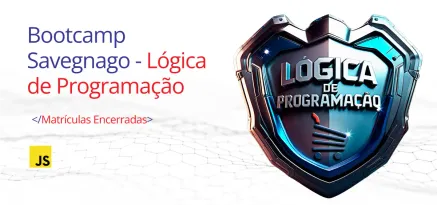

### BOOTCAMP SAVEGNAGO - LÓGICA DE PROGRAMAÇÃO

Conceitos desenvolvidos durante o **Bootcamp Savegnago - Lógica de Programação**, oferecido em parceria com a plataforma de ensino **Digital Innovation One - DIO**.

### Links

- [Digital Innovation One (DIO)](https://www.dio.me)
- [Bootcamp Savegnago - Lógica Programação](https://www.dio.me/bootcamp/savegnago-logica-de-programacao)

### Conceitos Desenvolvidos

[**Inteligencia Artificial**](#inteligencia-artificial) |
[**Intodução Lógica Programação**](#introdução-logica-programação) |
[**Operadores**](#operadores) |
[**Estruturas de Controle**](#estruturas-controle) |
[**Funções**](#funções) |
[**Computação em Nuvem**](#computacao-nuvem) |
[**Desafios de Projetos**](#desafios-projetos)

- **Introdução à Inteligência Artificial e Engenharia de Prompts**
    - Conceito de Machine Learning;
    - Conceito de NLP (Processamento de Linguagem Natural)
    - IAs Generativas
    - Modelos de Linguagens de Grande Escala (LLM)
    - Prompts
        - Fundamentos e aplicações práticas;
        - Componentes de um Prompt
            - Instrução;
            - Exemplos (Few-Shot Learning);
            - Contexto ou Configuração;
            - Restrições ou Limitações;
            - Conteúdo principal;
            - Indicações;
            - Formato de saída;
            - Conteúdo de suporte;
        - Técnicas de Engenharia de Prompt
            - Aplicar Instruções Objetivas e Detalhadas;
            - Repetir as Instruções ao Final do Prompt;
            - Guardrails;
            - Preparação da Saída;
            - Solicitar Cadeia de Pensamento à Resposta (passo a passo do raciocício);
            - Especificação da Estrutura de Saída;
            - Dividir a Tarefa em Etapas;
            - Adicionar Sintaxe de Organizada e de Fácil Visualização;

- **Introdução à Lógica de Programação**
    - Algoritmos, Fluxogramas, Input, Process, Output, Features (funcionalidades), IDE, variáveis (string, number, boolean, vetores e matrizes), comentários e constantes

- **Operadores**
    - operadores aritméticos (soma, subtração, multiplicação, divisão e módulo)
    - operadores de incremento (++) e decremento (--)
    - operadores de atribuição 
    - operadores relacionais
    - operadores lógicos

- **Estruturas de Controle**
    - condicionais, switch case, estruturas de repetição (for, while, do-while)

- **Funções**
    - Funções, Funções com parâmetros, Funções com retorno

- **Computação em Nuvem**
    - modelo de negócio: **as a service**
    - ambiente **On Premise** vs ambiente **Cloud**
    - hybrid model
    - Infra as a Service (IaaS)
        - Platform
            - AWS
            - Azure
            - Oracle
            - GCP (Google)
    - Regions & Zones
    - Benefícios da nuvem
        - Alta disponibilidade
        - Escalabilidade
        - Previsibilidade
        - Governança
        - Elasticidade
        - Confiabilidade
        - Segurança
        - Gerenciabilidade
    - Tipos de serviços de nuvem
        - IaaS (Infraestrutura como Serviço)
        - PaaS (Plataforma com Serviço)
        - Saas (Software como Serviço) 

- **Desafios de Projetos**
    - [Classificador de Nível de Herói]()
    - [Calculadora de Partidas Rankeadas]()
    - [Escrevendo as Classes de um Jogo]()

    

    
