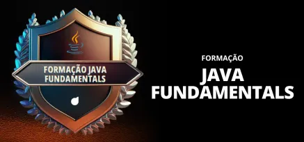

### FORMAÇÃO JAVA FUNDAMENTALS

Conceitos desenvolvidos durante o curso **Formação Java Fundamentals**, oferecido pela plataforma de ensino **Digital Innovation One - DIO**.

### Conceitos Desenvolvidos

- Conceitos Básicos em Java
    - Configuração do Ambiente Java
        - principais distribuições do JDK
        - Instalação do JDK
            - ambiente Windows
            - ambiente Linux
    - Gerenciadores de build
        - Maven
        - Gradle
- Fundamentos da Linguagem Java
    - keywords
    - tipos primitivos
    - operadores
        - atribuição
        - lógicos
        - aritméticos
            - soma, subtração, divisão multiplicação, módulo
            - função Math
                - raiz quadrada
                - potenciação
            - incremento e decremento
        - bitwise
    - **Exercícios**
- Estruturas de Controle
    - condicionais
    - switch-case
    - for
    - while
    - do-while
    - **Exercícios**

- Programação Orientada a Objetos em Java
    - Classes
    - Record
    - Encapsulamento
    - Herança
    - Polimorfismo
        - **Exercícios**
    - Interfaces
        - Interface
        - Interface Funcional
        - **Exercicios**

- Estruturas de Dados
    - List
    - Arrays
    - Set
        - HashSet
        - TreeSet
    - Map
    - Wrappers

- Classes
    - String
    - StringBuilder
    - StringBuffer
    - BigDecimal
    - Optional
    - Streams
    - Generics
    - Date
    - Calendar
    - LocalDate
    - LocalTime
    - LocalDateTime
    - OffsetDateTime

- Enumeration (Enum)

- Tratamento de Exceções

    - Implementação de um projeto **crud** para estudo de algumas possibilidades de tratamento de exceções. 
    - RunTimeException
    - Exception
    - Throwable
    - checked exceptions
    - unchecked exceptions
    - try-catch
    - throw
    - throws

- I/O: Input/Output (Gerenciamento de Arquivos)

    - IO (Input / Output)
    - NIO (New Input / Output)
    - NIO2

- Annotation e Annotation Processor
- SOLID
    - **S**RP (Single Responsability Principle)
    - **O**CP (Open/Close Principle)
    - **L**SP (Likov Substitution Principle)
    - **I**SP (Interface Segregation Principle)
    - **D**IP (Dependency Inversion Principle)
- Refatoramento de Código
- Persistência de Dados com Java e MySql

### Desafios de Projetos
- [Criando um Jogo do Sudoku em Java](https://github.com/astorti/projetos-dio/tree/main/Java/JogoSudoku)
- [Criando seu Board de Tarefas com Java](https://github.com/astorti/projetos-dio/tree/main/Java/Board)
    