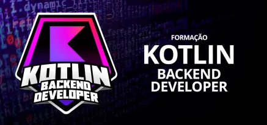

### FORMAÇÃO KOTLIN BACKEND DEVELOPER

Conceitos desenvolvidos durante o curso **Formação Kotlin Backend Developer**, oferecido pela plataforma de ensino **Digital Innovation One - DIO**.

### Links

- [Kotlin Docs](https://kotlinlang.org/docs/home.html)
- [Kotlin Tour Docs](https://kotlinlang.org/docs/kotlin-tour-welcome.html)
- [Github Curso Kotlin DIO](https://github.com/digitalinnovationone/aprenda-kotlin-com-exemplos)

### Conceitos Desenvolvidos

Foram estudados conceitos de **metodologias ágeis**, incluindo **Manifesto Ágil**, seus valores e princípios, **gestão ágil de projetos**, diferenças entre modelos tradicionais e ágeis, além dos métodos **Scrum, Extreme Programming (XP), Kanban e OKR**.

Nos **fundamentos de Kotlin**, foram abordados **variáveis mutáveis e imutáveis (`var` e `val`)**, **funções**, parâmetros padrão, argumentos nomeados e `vararg`, **classes**, **null safety**, estruturas de controle (`when`, `for`, `while` e `do while`), iteradores, ranges, expressões condicionais e operadores de igualdade. Também foram estudadas **coleções** (`List`, `Set` e `Map`) e funções como `filter`, `map` e `flatMap`.

Em **Programação Orientada a Objetos**, foram desenvolvidos os conceitos de **abstração**, **herança**, **data classes**, **enum classes**, **sealed classes** e **Object Keyword**. Em funções, foram estudadas as **funções de escopo** (`let`, `run`, `with`, `apply` e `also`), **infix functions**, **operator functions**, **higher-order functions**, **lambda functions**, **extension functions e properties**, **extension functions generics** e **suspended functions**. Também foi abordado o **tratamento de exceções**.

Na construção de **APIs REST**, foram estudados os conceitos de **REST**, arquitetura **cliente-servidor**, comunicação por **HTTP**, troca de dados ocorre em formato **JSON**, **stateless**, métodos HTTP (`GET`, `POST`, `PUT`, `PATCH` e `DELETE`) e **HTTP Status Codes**, abrangendo códigos de sucesso, redirecionamento, erros do cliente e erros do servidor.

Por fim, foram introduzidos o **Spring Framework**, **Spring Boot Starters**, **Spring Initializr** e a **arquitetura de três camadas**, composta pelas camadas de **apresentação**, **lógica de negócio** e **acesso a dados**.

##### Prática: Spring Boot — Criando uma API Rest com Kotlin e Persistência de Dados: *Credit Application System*

O curso de prática em Spring Boot desenvolve uma API REST para um sistema de solicitação de crédito.

O sistema utiliza as seguintes ferramentas:  **Spring Boot**, **Spring Data JPA**, **Hibernate**, **H2**, **Flyway** e **Bean Validation**, com foco na integração entre API, persistência de dados, validações e tratamento de exceções.

A implementação acompanha o projeto proposto no curso, com adaptações para versões atuais das ferramentas e bibliotecas utilizadas no ambiente de desenvolvimento.

[Ir para o codigo](https://github.com/astorti/formacao-kotlin-backend-developer-DIO/tree/main/spring-boot/credit-application-system)

---

---

### Projetos

##### Abstraindo Formações da DIO Usando Orientação a Objetos com Kotlin

[Ir para o código](https://github.com/astorti/projetos-dio/tree/main/Kotlin/AbstraindoFormacoesDIO-UsandoOrientacaoObjetosComKotlin)

---

##### Projeto Final — Documentação e Testes de API REST

Projeto final desenvolvido na Formação Kotlin a partir da API de crédito criada durante o curso de Spring Boot. Nesta etapa, a API foi utilizada em conjunto com as tecnologias **OpenAPI/Swagger, JUnit 5, AssertJ, MockK, MockMvc e H2** para aplicar conceitos de documentação com OpenAPI/Swagger e testes automatizados, complementando o projeto original.

[Ir para o código](https://github.com/astorti/projetos-dio/tree/main/Kotlin/DocumentandoETestandoSuaAPIRestComKotlin/credit-application-system)

