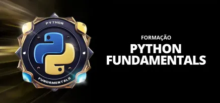

### FORMAÇÃO PYTHON FUNDAMENTALS

Conceitos desenvolvidos durante o curso **Formação Python Fundametals**, oferecido pela plataforma de ensino **Digital Innovation One - DIO**.

### Conceitos Desenvolvidos

- **Fundamentos do Python**
    - Origem e objetivos linguagem de programação Python
    - Instalação do Python
        
    - Tipos de dados
        - built-in
            - texto: **str**
            - numérico: **int**, **float**, **complex**
            - sequência: **list**, **tuple**, **range**
            - mapa: **dict**
            - coleção: **set**, **frozenset**
            - booleano: **bool**
            - binário: **bytes**, **bytearray**, **memoryview**

    - Modos interativos e Funções ***Dir()*** e ***Help()***

    - Variaveis e Constantes
    - Boas práticas em Python
        - Os nomes das variáveis devem ser no padrão snake case;
        - Nomes as constantes todo em maiúsculo   
    - Função "input"
    - Operadores
        - Operadores Aritmeticos
            - soma
            - subtração
            - divisão
            - multiplicação
            - resto
            - exponenciação
        - Operadores de Comparação
            - igualdade (==)
            - diferença (!=)
            - maior (>)
            - maior ou igual (>=)
            - menor (<)
            - menor ou igual (<=)
        - Operadores de Atribuição
            - =, +=, -=, /=, //=, *=, **=, %=
        - Operadores Lógicos
            - and
            - or
            - not
        - Operdaores de Identidade
            - is
            - is not
        - Operadores de Associação
            - in
            - not in
    - Identação e Blocos de Códigos
    - Estruturas Condicionais
    - Estruturas de Repetição
        - for
        - while
        - break, continue
    - String

- **Estrutura de Dados**
    - Listas
        - métodos: append, clear, copy, count, extend, index, pop, remove, reverse, sort, len
        - função: sorted
    - Tuplas
        - métodos: count, index, len
    - Conjuntos
        - métodos: union, intersection, difference, symmetric_difference, issubset, issuperset, isdisjoint, add, clear, copy, discard, pop, remove, len, in
    - Dicionarios
        - métodos: clear, copy, fromkeys, get, items, keys, pop, popitem, setdefault, update, values, in, del
    - Funções

- **Programação Orientada a Objetos**
    - Classes e Objetos
    - Construtores
    - Herança Simples e Herança Multipla
    - Encapsulamento
        - Recursos Publicos (**public**) e Privados (**private**)
        - Property
    - Polimorfismo
    - Variáveis de Classe e Variáveis de Instância 
    - Métodos estáticos e Métodos de classe
    - Classes abstratas
    
- **Decoradores**, **Iteradores** e **Geradores**

- **Data e Hora**
    - date
    - datetime
    - time
    - timedelta
    - timezone

- **Arquivos em Python**
    - leitura e escrita de arquivos de texto (.txt)
    - gerenciamento de arquivos e diretórios
    - tratamento de exceções
    - arquivos csv

