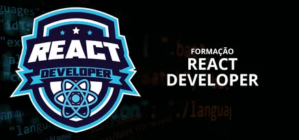

### FORMAÇÃO REACT DEVELOPER

Conceitos desenvolvidos durante o curso **Formação React Developer**, oferecido pela plataforma de ensino **Digital Innovation One - DIO**.

### Links

- [Digital Innovation One (DIO)](https://www.dio.me)
- [Formação React Developer](https://www.dio.me/curso-react)

### Conceitos Desenvolvidos

- **HTML, CSS, JAVASCRIPT**

- **REACT**
    - componentes
    - ciclo de vida dos componentes
    - hooks
        - useState
        - useEffect
        - useMemo
        - useCallback
        - useContext
    - async, await, fetch
    - bibliotecas: 
        - babel
        - webpack
        - eslint
        - prettier
        - react-router-dom
        - react-hook-form
        - axios
    - styled-componets
    - typescript

- **NEXT.JS**

### **Desafios de Projetos**

- [blog-next-app]() 
- [calculadora]()
- [clone-tela-cadastro-dio]()
- [login-react-typescript]()
- [wiki-repositorios-github]()